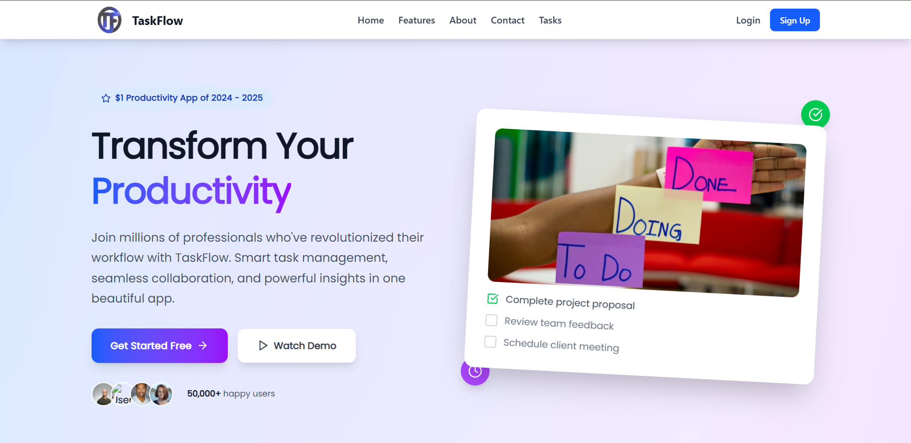
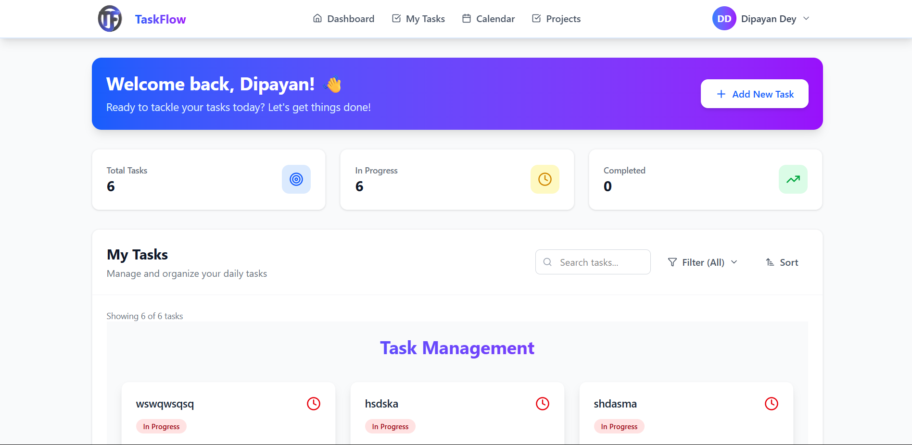
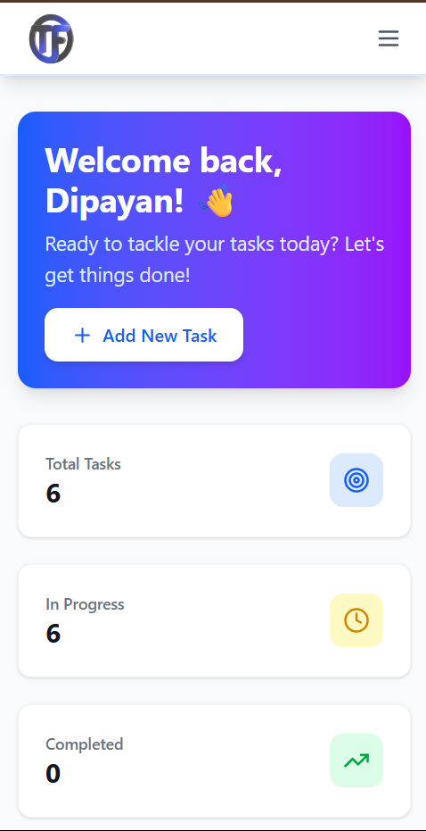

# 🌀 Task Flow - Task Manager Web App

> ✨ A modern and interactive task management web app built with **MERN Stack** (MongoDB, Express.js, React, Node.js).  
> 📌 Organize, track, and prioritize your daily tasks seamlessly.

| Banner 1 | Banner 2 |
|--------|--------|
|  |  |
---

## 🌟 Features

✅ Create, update, delete tasks  
✅ Set due dates and priorities  
✅ Track task status (To-Do / In Progress / Done)  
✅ Fully responsive UI with modern design  
✅ Built with scalable MERN architecture  
✅ Toast notifications for actions  
✅ RESTful API backend  
✅ Modular code structure for easy scalability

---

## 🎨 Tech Stack

| Frontend | Backend | Database | Styling | Others |
|----------|---------|----------|---------|--------|
| React.js | Node.js | MongoDB  | Tailwind CSS | Axios, React Toastify |
| Vite     | Express | Mongoose | DaisyUI      | dotenv, cors         |

---

## 🖼️ UI Preview

> Sample Screenshots of Task Flow

| Mobile | Mobile |
|--------|--------|
|  |  |

---

## 📁 Project Structure

TaskFlow/
├── FrontEnd/ # React frontend
│ ├── public/
│ └── src/
│ ├── components/
│ ├── pages/
│ ├── utils/
│ └── App.jsx
├── Backend/ # Node/Express backend
│ ├── controllers/
│ ├── models/
│ ├── routes/
│ └── index.js
├── .env
├── README.md
└── package.json


---

## 🚀 Getting Started

### ⚙️ Prerequisites
- Node.js ≥ 18
- MongoDB installed or use [MongoDB Atlas](https://www.mongodb.com/cloud/atlas)

---

### 🔧 Backend Setup

```bash
cd server
npm install
# Set up .env file
touch .env

| Method | Route           | Description     |
| ------ | --------------- | --------------- |
| GET    | /api/tasks      | Get all tasks   |
| POST   | /api/tasks      | Create new task |
| PUT    | /api/tasks/\:id | Update a task   |
| DELETE | /api/tasks/\:id | Delete a task   |


⚒️ Built With
React - Frontend UI Library
Tailwind CSS - Styling
Node.js + Express - Backend API
MongoDB + Mongoose - Database
Vite - Lightning-fast frontend dev environment

📢 Upcoming Features
 User authentication (JWT)
 Drag & drop task ordering
 Dark mode toggle
 Task reminders via email/notification
 Analytics dashboard

 👨‍💻 Developer Info
💼 Project Author: Dipayan Dey
🌐 Portfolio: (https://dipayan-dey.github.io/portfolio/)
📬 Contact: (deydipayan2006@gmail.com)